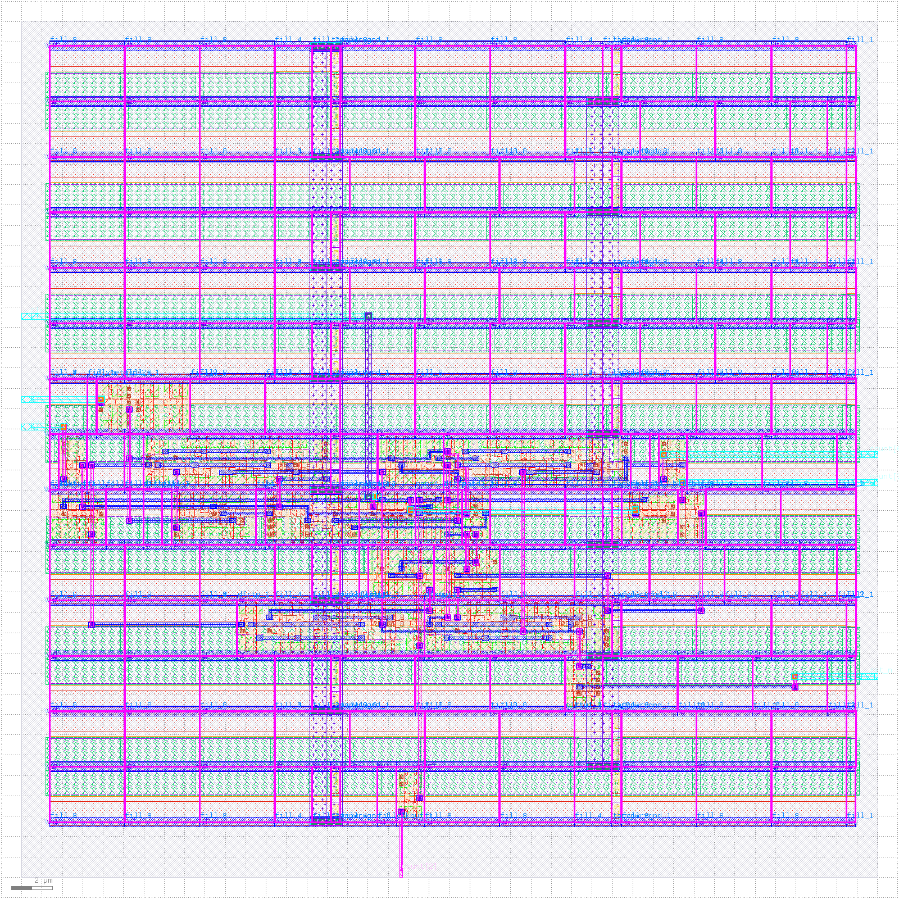
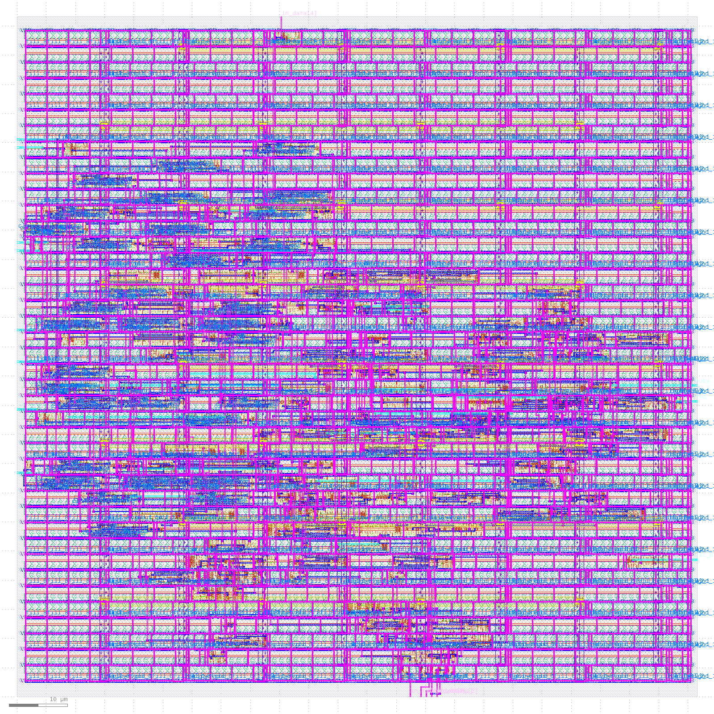
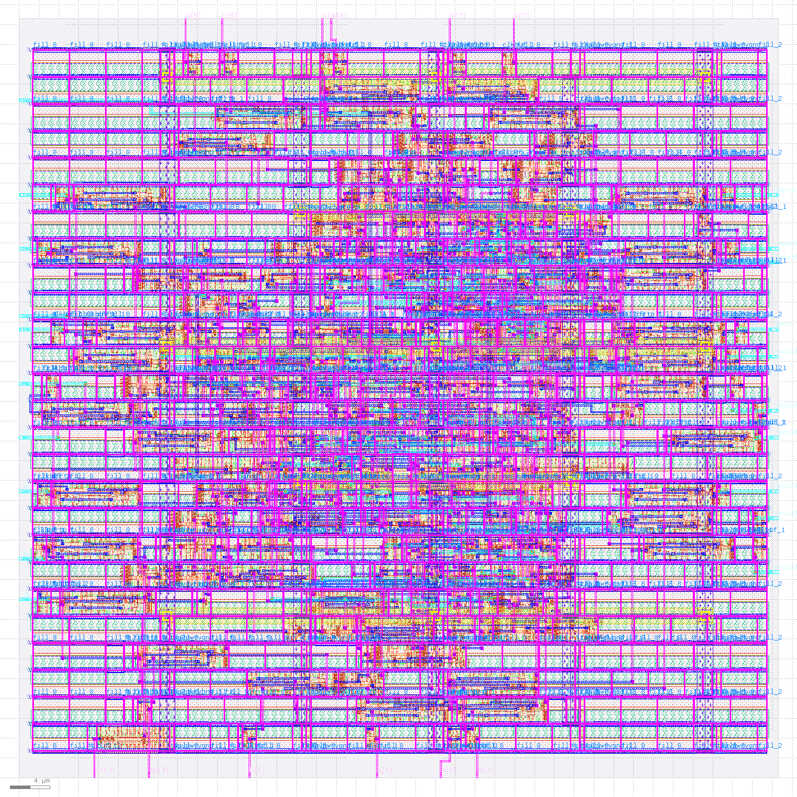
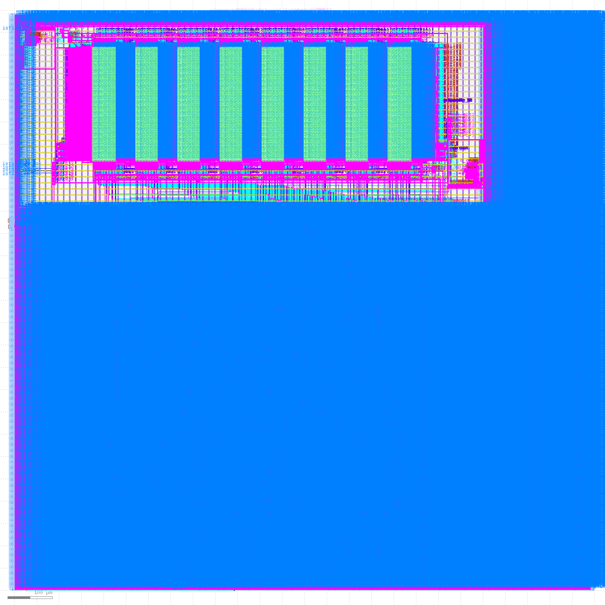

# OpenSoC-RTL2GDS

Open-source RTL-to-GDS training workspace using `Verilog + Verilator + Yosys + OpenROAD-flow-scripts + SKY130HD`.

이 저장소는 작은 RTL 예제에서 시작해 `UART -> ALU -> systolic array -> PicoRV32 -> SRAM-integrated SoC`로 확장하면서, 오픈소스 디지털 ASIC flow를 실제 결과물 중심으로 재현하는 것을 목표로 합니다.

처음 시작할 때는 `designs/01_counter4`에서 RTL을 보고, `training/01_counter4`에서 번호별 스크립트를 실행하면 됩니다.

## Abstract

상용 EDA 대신 오픈소스 스택만으로도 RTL에서 GDS-II까지 일관된 flow를 구성할 수 있는지, 그리고 디자인 복잡도가 증가할 때 면적/전력/타이밍 특성이 어떻게 변하는지를 단계적으로 관찰하기 위한 실습형 저장소입니다.

핵심 포인트는 다음 세 가지입니다.

1. `training/` 트랙에서 초보자가 번호별 스크립트를 따라가며 flow의 각 단계를 직접 확인할 수 있습니다.
2. `designs/` 트랙에서 동일한 도구 체인으로 더 큰 설계를 재현할 수 있습니다.
3. 실제 GDS와 timing report를 남겨 문서가 설명용이 아니라 재현 가능한 결과 기록이 되도록 구성했습니다.

## Key Results

| Phase | Design | PDK | Area | Power | Timing | GDS |
|-------|--------|-----|------|-------|--------|-----|
| 1 | Counter4 training | sky130hd | 235 µm² | - | met | 114KB |
| 2 | UART TX + FIFO + ICG | sky130hd | 2,626 µm² | - | met | 791KB |
| 3 | ALU 8-bit pipelined | sky130hd | ~1,600 µm² | 0.66mW | met | 750KB |
| 4 | 2x2 Systolic Array | sky130hd | 17,229 µm² | 7.73mW | +4.02ns | 2.5MB |
| 5 | PicoRV32 (RV32I) | sky130hd | 102,600 µm² | 16.0mW | +4.75ns | 12MB |
| 6 | PicoRV32 + SRAM 2KB | sky130hd | 544,466 µm² | 18.2mW | +7.02ns | 32MB |

## Representative Figures

| Figure | Preview |
|--------|---------|
| Fig. 1. `counter4` GDS preview. Small standard-cell design with visible PDN stripes and a compact routed logic island. |  |
| Fig. 2. `uart_tx` GDS preview. Multi-file RTL with routing density spread across serializer, FIFO, and control logic. |  |
| Fig. 3. `alu` GDS preview. Datapath-centric block with dense central routing around arithmetic logic. |  |
| Fig. 4. `picosoc_mini` GDS preview. Macro-dominated SoC floorplan where SRAM footprint dominates die area. |  |

이 이미지는 저장소 안의 실제 `6_final.gds`에서 KLayout batch rendering으로 추출한 미리보기입니다.

## Experimental Stack

| Tool | Version | Role |
|------|---------|------|
| Verilator | 5.036 | RTL simulation with C++ testbench |
| Yosys | 0.63 | RTL synthesis |
| OpenROAD | v2.0 | floorplan, placement, CTS, routing |
| OpenSTA | 2.6.0 | static timing analysis |
| ORFS | b811251d2 | Makefile-based RTL-to-GDS orchestration |
| KLayout | 0.29.7 | DEF-to-GDS merge and GDS viewing |
| Magic | 8.3.636 | DRC |
| Netgen | 1.5 | LVS |
| open_pdks | current local build | SKY130 installation |

PDK는 기본적으로 `SKY130HD`를 사용합니다. 일부 문서와 로그에는 `GF180` 비교 실험이 포함되지만, 기본 재현 경로는 `SKY130HD` 하나에 맞춰져 있습니다.

## Reproducibility

### 1. One-Time Setup

```bash
git clone git@github.com:Song-Joo-Young/OpenSoC-RTL2GDS.git
cd OpenSoC-RTL2GDS

bash scripts/setup_tools.sh
bash scripts/setup_pdk.sh
source env.sh
```

처음 설치에서 시간이 가장 오래 걸리는 구간은 `setup_pdk.sh` 입니다. 첫 설치 후에는 대부분의 training run이 수초~수분 내에 끝납니다.

### 2. Start Here

가장 자연스러운 입문 순서는 아래와 같습니다.

1. `designs/01_counter4/src/counter4.v`로 가장 작은 RTL을 읽습니다.
2. `bash training/01_counter4/01_sim.sh`로 기능 검증을 봅니다.
3. `bash training/01_counter4/99_fullflow.sh`로 첫 GDS를 만듭니다.
4. 이후 `02_uart_tx -> 03_alu -> 04_systolic -> 05_picorv32` 순서로 확장합니다.

### 3. Recommended Reader Path

| Stage | Goal | Command |
|------|------|---------|
| `training/01_counter4` | 가장 작은 end-to-end flow | `bash training/01_counter4/01_sim.sh` then `bash training/01_counter4/99_fullflow.sh` |
| `training/02_uart_tx` | multi-file RTL, filelist, ICG | `bash training/02_uart_tx/01_sim.sh` then `bash training/02_uart_tx/99_fullflow.sh` |
| `training/03_alu` | pipelined datapath | `bash training/03_alu/01_sim.sh` then `bash training/03_alu/99_fullflow.sh` |
| `training/04_systolic` | arithmetic-heavy accelerator-style block | `bash training/04_systolic/01_sim.sh` then `bash training/04_systolic/99_fullflow.sh` |
| `training/05_picorv32` | CPU-scale training track | `bash training/05_picorv32/01_sim.sh` then `bash training/05_picorv32/99_fullflow.sh` |
| `designs/06_soc` | macro-integrated SoC | `cd $ORFS/flow && make DESIGN_CONFIG=./designs/sky130hd/picosoc_mini/config.mk` |

`01`부터 `05`까지는 `training/`에서 실행하고, 실제 RTL과 제약은 같은 번호의 `designs/`에서 읽는 구조입니다. `06_soc`부터는 training wrapper 없이 ORFS 설정을 직접 사용합니다.

### 3a. Bring Your Own RTL

임의의 RTL이나 외부 open-source RTL을 training 방식으로 태우고 싶다면 `runs/template_rtl/`를 복제해서 쓰면 됩니다.

```bash
cp -r runs/template_rtl runs/my_design
cd runs/my_design

# 1) design.cfg 에서 RUN_NAME / TOP_MODULE 수정
# 2) rtl.f 수정
# 3) src/, constraints/ 채우기
# 4) 테스트벤치가 있으면 tb/와 ENABLE_SIM=1 설정

bash 00_clean.sh
bash 01_sim.sh        # ENABLE_SIM=1일 때
bash 02_setup_ORFS.sh
bash 99_fullflow.sh
```

즉, `training/`은 curated example, `runs/`는 사용자 커스텀 run workspace로 보면 됩니다.
이 템플릿은 `RUN_NAME`(run 식별자)와 `TOP_MODULE`(실제 RTL top)를 분리해서 다룹니다.

### 4. Step-by-Step Inspection

`training/01_counter4/` 에서는 아래 번호별 스크립트로 각 단계를 따로 볼 수 있습니다.

```bash
bash training/01_counter4/00_clean.sh
bash training/01_counter4/01_sim.sh
bash training/01_counter4/02_setup_ORFS.sh
bash training/01_counter4/03_synth.sh
bash training/01_counter4/04_sta.sh
bash training/01_counter4/05_floorplan.sh
bash training/01_counter4/06_place.sh
bash training/01_counter4/07_cts.sh
bash training/01_counter4/08_route.sh
bash training/01_counter4/09_sta_post.sh
bash training/01_counter4/10_gds.sh
bash training/01_counter4/11_signoff.sh
```

## Flow Assessment

현재 저장소 기준으로 사용자가 하나씩 따라가기 가장 매끄러운 구간은 `training/01_counter4` 부터 `training/05_picorv32` 까지입니다.

### Smooth Path

- 각 training 디렉토리에 `design.cfg`, `00_clean.sh`, `01_sim.sh`, `99_fullflow.sh`가 일관된 형태로 존재합니다.
- `designs/01_counter4`, `designs/02_uart_tx`, `designs/03_alu`, `designs/04_systolic`는 `Makefile` 기반 로컬 simulation 경로도 별도로 제공합니다.
- `env.sh`가 ORFS, Yosys, OpenRAM 주요 경로를 한 번에 잡아줍니다.

### Current Friction Points

아래 항목들은 README를 읽고 바로 알 수 있어야 하는 실제 friction 입니다.

1. ORFS 기본 GDS merge를 그대로 쓰지 않고, training 스크립트에서 KLayout merge를 수동으로 한 번 더 수행합니다.
   이유: 일부 경우 ORFS 내장 merge가 `merged.lef`의 duplicate MACRO name 문제에 걸릴 수 있기 때문입니다.
2. `99_fullflow.sh` 내부에서 `congestion.rpt` placeholder를 만드는 workaround가 포함되어 있습니다.
3. `11_signoff.sh`의 DRC는 바로 실행되지만, LVS는 `layout SPICE`가 있을 때만 Netgen 비교를 수행합니다.
   즉, 현재 문서상 full flow는 "GDS 생성까지는 매끄럽고, sign-off는 부분 수동"에 가깝습니다.
4. headless 서버에서는 `QT_QPA_PLATFORM=offscreen`이 필요한 경우가 있습니다. 다만 이 변수는 GUI 사용을 기본값으로 막지 않기 위해 `env.sh`에 강제하지 않았습니다.

이 네 가지를 감안하면, 현재 저장소는 "초기 학습과 GDS 생성 재현"에는 충분히 매끄럽고, "완전 자동 sign-off flow"까지는 아직 보강 중이라고 보는 것이 정확합니다.

## Flow Overview

```text
RTL (Verilog)
    │
    ├─ Simulation (Verilator)
    │
    ├─ Synthesis (Yosys)
    │
    ├─ Pre-route STA (OpenSTA)
    │
    ├─ Floorplan / Place / CTS / Route (OpenROAD)
    │
    ├─ Post-route STA (OpenSTA)
    │
    ├─ DEF-to-GDS merge (KLayout)
    │
    └─ DRC / LVS (Magic / Netgen)
```

## What Each Design Shows

| Path | Focus |
|------|-------|
| `training/01_counter4` | smallest complete training flow |
| `training/02_uart_tx` | filelist-based RTL, FIFO, serializer, ICG |
| `training/03_alu` | 2-stage pipelined datapath |
| `training/04_systolic` | multiplier-heavy accelerator block |
| `training/05_picorv32` | CPU-scale open-source RTL |
| `designs/06_soc` | SRAM macro integration and macro-dominant floorplan |

## Directory Structure

```text
designs/          RTL designs and Makefile-based local simulation
  01_counter4/      Smallest training-aligned counter example
  02_uart_tx/       UART TX + FIFO + ICG
  03_alu/           Pipelined ALU
  04_systolic/      2x2 systolic array
  05_picorv32/      RISC-V CPU
  06_soc/           PicoRV32 + SRAM SoC
  legacy_gcd/       Archived ORFS example wrapper/config

training/         Guided numbered scripts for end-to-end learning
runs/             User-owned run workspaces and generic template
scripts/          Setup helpers and utility scripts
docs/             Guides, reports, figures
tools/            Tool sources and local installs
pdk/              Installed PDK files
results/          Generated outputs
```

## Documentation

| Document | Purpose |
|----------|---------|
| [docs/training_guide.md](docs/training_guide.md) | step-by-step training guide |
| [docs/study_roadmap.md](docs/study_roadmap.md) | recommended reading order |
| [docs/dual_track_guide.md](docs/dual_track_guide.md) | ORFS vs OpenLane comparison |
| [docs/tool_analysis.md](docs/tool_analysis.md) | OpenROAD / ORFS / OpenRAM internals |
| [runs/template_rtl/README.md](runs/template_rtl/README.md) | generic run directory for your own RTL |
| [docs/progress.md](docs/progress.md) | measured phase-by-phase results |
| [docs/blog_rtl_to_gds.md](docs/blog_rtl_to_gds.md) | long-form narrative walkthrough |

## About `sram-lib-gen`

현재 워크스페이스에는 `sram-lib-gen/` 이 존재하지만, 이 항목이 아직 별도 Git 히스토리로 관리되지 않았다면 메인 저장소의 핵심 재현 경로와는 분리해서 보는 편이 맞습니다.

권장 방식은 둘 중 하나입니다.

1. 독립 저장소로 분리하고, 이 README에서는 "companion project"로만 짧게 언급합니다.
2. 아직 공개할 계획이 없다면, 메인 README의 주 흐름에서는 빼고 로컬 전용 실험 디렉토리로만 유지합니다.

즉, 이 저장소의 공개 README는 `OpenSoC-RTL2GDS` 본체만으로 완결되게 유지하는 것이 좋습니다.

## Known Limitations

- fully automated DRC/LVS closure는 아직 보강 여지가 있습니다.
- OpenLane 결과와의 정량 비교는 문서에 가이드가 있지만 기본 flow의 일부는 아닙니다.
- `designs/legacy_gcd`는 보관용 예제로 남아 있으며, 기본 학습 순서에는 포함되지 않습니다.

## License

이 프로젝트는 학습 및 연구 목적의 작업공간입니다. 각 오픈소스 도구와 PDK의 개별 라이선스를 따릅니다.
